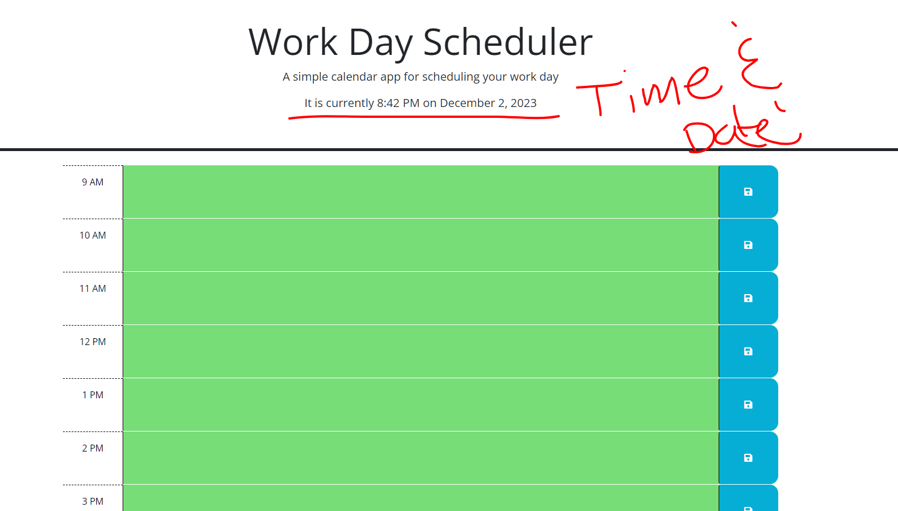
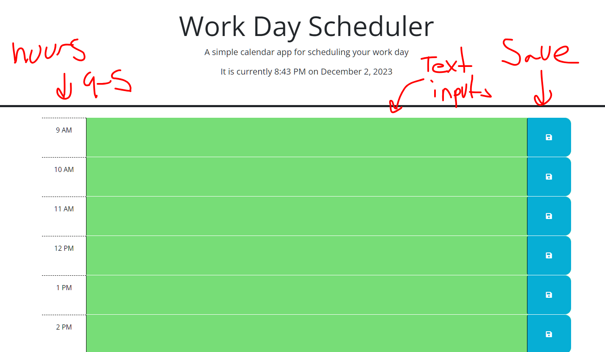
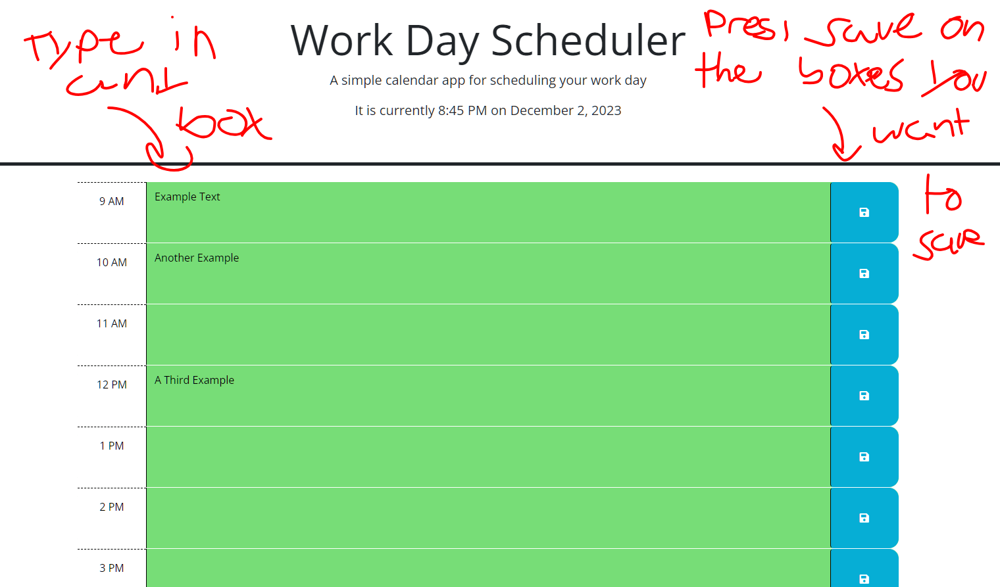

# The 925

## Description

The 925 is a work day scheduler for the hours of 9am to 5pm. The name is a play on words because 925 sounds like 9-to-5 when spoken aloud. Anyone can write text in the boxes and itll be there even if you leave and come back. Its great for organizing your time for the day by the hour.

## Installation

All thats necessary is to clone the repo. No dependancies

```bash
git clone git@github.com:GammaTwoo/The-925.git
```


## Usage

Deployed Site: https://gammatwoo.github.io/The-925/ 



At the top of the page is the date and time, right under the title and introduction. 



There are 3 columns. The far left is the time that you are saving the text to. The middle is the input for any text you want to save. The right is a button that saves the text in the middle column to local storage when clicked.



When the save button is pressed, the text in the corresponding input is saved into local storage. On page load, the text is taken from local storage and each hour is populated with its corresponding data.

~Not pictured~
    Reloading the page

Note: the screenshots were taken before i had change the title, header, and description of the page

## License

Copyright 2023 Gavin Frazier

Permission is hereby granted, free of charge, to any person obtaining a copy of this software and associated documentation files (the “Software”), to deal in the Software without restriction, including without limitation the rights to use, copy, modify, merge, publish, distribute, sublicense, and/or sell copies of the Software, and to permit persons to whom the Software is furnished to do so, subject to the following conditions:

The above copyright notice and this permission notice shall be included in all copies or substantial portions of the Software.

THE SOFTWARE IS PROVIDED “AS IS”, WITHOUT WARRANTY OF ANY KIND, EXPRESS OR IMPLIED, INCLUDING BUT NOT LIMITED TO THE WARRANTIES OF MERCHANTABILITY, FITNESS FOR A PARTICULAR PURPOSE AND NONINFRINGEMENT. IN NO EVENT SHALL THE AUTHORS OR COPYRIGHT HOLDERS BE LIABLE FOR ANY CLAIM, DAMAGES OR OTHER LIABILITY, WHETHER IN AN ACTION OF CONTRACT, TORT OR OTHERWISE, ARISING FROM, OUT OF OR IN CONNECTION WITH THE SOFTWARE OR THE USE OR OTHER DEALINGS IN THE SOFTWARE.